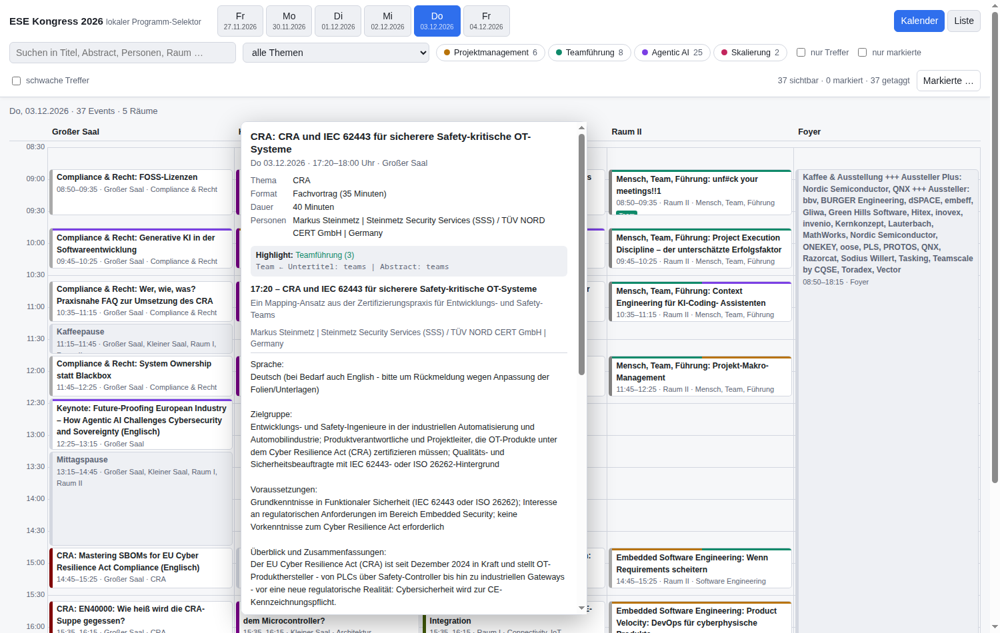
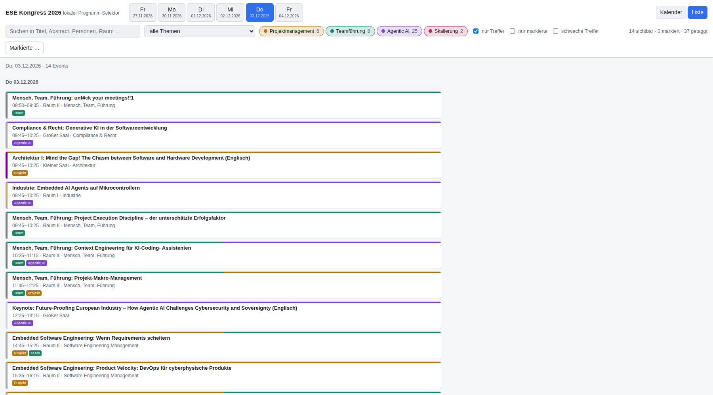

# ESE Kongress 2026 – Programm-Selektor

[](https://github.com/marcelpetrick/ESE_Kongress_Selektor/actions/workflows/ci.yml)
[](LICENSE)
[](https://www.python.org/downloads/)
[](#continuous-integration)

By Marcel Petrick <mail@marcelpetrick.it>.

A small, unofficial tool for browsing the [Embedded Software Engineering
Kongress 2026](https://ese-kongress.de/frontend/index.php?page_id=53095&v=TimeTable)
programme more comfortably. It adds instant abstracts, persistent marks,
search, exports, and highlights for **project management**, **team leadership**,
**agentic AI**, and **scaling**. It is only a browsing aid; it is not affiliated
with the congress organisers.



## Run it

```bash
python3 run.py          # Linux and macOS
py run.py               # Windows
```

That is the complete setup. Starting with only Python 3.10 or newer, `run.py`
creates `.venv/`, installs the two pinned packages, downloads the programme,
builds the local viewer, and opens it. The first download makes roughly 140
polite requests and takes about two minutes; later runs reuse the local copy and
usually finish in a few seconds.

| flag | effect |
| --- | --- |
| `--refresh` | download every page again instead of reusing `data/raw/` |
| `--skip-crawl` | rebuild from an existing `data/raw/` without network access |
| `--serve [PORT]` | serve at `http://localhost:8765` (or the supplied port) |
| `--no-open` | build without opening a browser |
| `--no-venv` | use the current interpreter; `requests` and `bs4` must be installed |
| `--clean` | remove `.venv/`, `data/`, and `web/data.js` |
| `-v`, `--verbose` | also list pages reused from the crawl cache |

`--refresh` and `--skip-crawl` are intentionally mutually exclusive. On a
system with Make, `make run`, `make serve`, `make refresh`, `make report`,
`make check`, `make test`, and `make clean` wrap the same commands.

### Windows

Install Python from python.org and select *Add python.exe to PATH*, then run
`py run.py`. No Make, shell, or administrator rights are needed. The bootstrap
uses `.venv\Scripts\python.exe` and forces UTF-8 console output so programme
umlauts also work with legacy Windows code pages.

If a browser blocks `localStorage` for `file://` pages, marks cannot survive a
reload. Use `python3 run.py --serve` (or `py run.py --serve`) to open the viewer
through `http://localhost:8765` instead.

## Use the viewer



| interaction | result |
| --- | --- |
| hover an event | show topic, format, speakers, duration, and the full abstract |
| click an event | mark or unmark it in browser-local storage |
| category chips | dim non-matches; *nur Treffer* hides them |
| *schwache Treffer* | include matches below the strong-score threshold |
| search and topic filter | search all event text or restrict the programme topic |
| *nur markierte* | show only the personal selection |
| *Markierte …* | export Markdown, JSON, or iCal; import marks from JSON |
| Kalender / Liste | switch between the room grid and flat chronological list |
| Esc | close the detail popup |

The selected day, filters, view, and marks survive reloads. Everything stays in
the browser; the viewer uploads nothing.

## How it works

```text
run.py               bootstrap: venv -> dependencies -> crawl -> build -> browser
crawler/crawl.py     ese-kongress.de -> data/raw/*.html
crawler/parse.py     data/raw/ -> data/congress.json + web/data.js
crawler/classify.py  weighted rules for the four highlight categories
web/                 dependency-free HTML/CSS/JavaScript viewer
```

The schedule is a server-rendered Converia frontend, so ordinary HTTP requests
are sufficient. Timetable pages provide rooms, times, and event links; session
and general-event pages provide details and abstracts. The site already sends
the abstract markup and merely hides it with CSS. `--start-day` defaults to
`6480` (Monday, 30 November 2026), after which the site's own day switcher
provides the remaining day identifiers.

Typical result: 6 days, 133 events, 116 contributions with abstracts, and 31
topics. `crawler/classify.py` scores distinct keyword matches by field: topic 4,
title 3, subtitle 2, and abstract 1. A score of 3 is strong; lower scores remain
available as weak matches. The popup always shows which fields and keywords
caused a highlight. Run `make report` to audit every match.

Abstract HTML is sanitised before display: active elements, `on*` handlers, and
`javascript:` URLs are removed.

## Continuous integration

The [quality workflow](.github/workflows/ci.yml) runs the same
`python localPipeline.py` command as `make check`, so local checks and CI cannot
drift. Its offline gate performs these checks:

1. byte-compile all Python sources;
2. run the unit tests against synthetic Converia-shaped fixtures;
3. build and reload both output formats end to end;
4. parse `web/app.js` with Node when Node is available.

The gate covers Python 3.10 through 3.14 on Ubuntu and Python 3.14 on Windows
and macOS. Separate Linux and Windows jobs prove the one-command bootstrap.
Pushes and pull requests never contact the congress site; only the scheduled or
manually started weekly canary makes one live request to detect markup changes.
Locally, `python localPipeline.py --browser` adds a headless Chromium render and
`--network` adds that same live canary.

The [release workflow](.github/workflows/release.yml) runs the quality gate
again for an existing `vMAJOR.MINOR.PATCH` tag. It then creates a clean source
ZIP from tracked files, generates `SHA256SUMS.txt`, and publishes both in an
idempotent GitHub Release with generated notes. It can be triggered by pushing
the tag or manually for an existing tag; it never packages downloaded congress
content or generated viewer data.

## Dependencies

| dependency | exact requirement | enforcement |
| --- | --- | --- |
| Python | 3.10 or newer | `run.MIN_PYTHON`, unit test, CI version matrix, badge |
| beautifulsoup4 | 4.15.0 | exact `requirements.txt` pin and pin-format unit test |
| requests | 2.34.2 | exact `requirements.txt` pin and pin-format unit test |
| Node | optional | CI/local JavaScript syntax check only; not needed to run the viewer |
| Chromium | optional | used only by `localPipeline.py --browser` |

The generated `data/` directory and `web/data.js` are intentionally ignored.
Programme content belongs to the congress organisers and is downloaded only
for personal reading and planning; no scraped congress text is redistributed
in this repository. Test fixtures copy only the relevant HTML structure and use
invented content.

## License

GPL-3.0-or-later — see [LICENSE](LICENSE).

Copyright (C) 2026 Marcel Petrick <mail@marcelpetrick.it>
